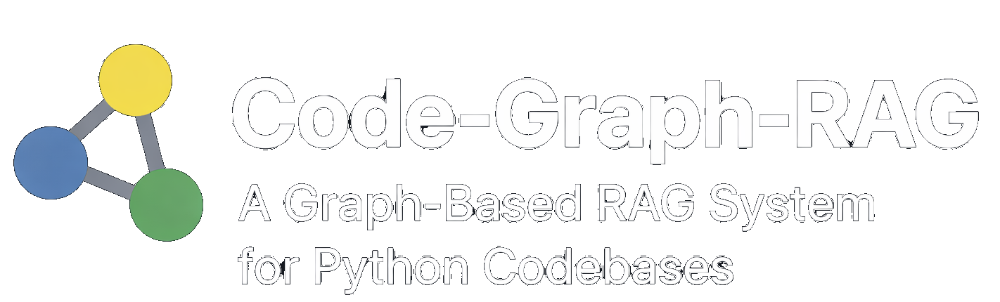

<div align="center">
  <picture>
    <source srcset="assets/logo-dark-any.png" media="(prefers-color-scheme: dark)">
    <source srcset="assets/logo-light-any.png" media="(prefers-color-scheme: light)">
    
  </picture>

  <p>
  <a href="https://github.com/vitali87/code-graph-rag/stargazers">
    
  </a>
  <a href="https://github.com/vitali87/code-graph-rag/network/members">
    
  </a>
  <a href="https://github.com/vitali87/code-graph-rag/blob/main/LICENSE">
    
  </a>
  <a href="https://mseep.ai/app/vitali87-code-graph-rag">
    
  </a>
  <a href="https://code-graph-rag.com">
    
  </a>
</p>
</div>

# Code-Graph-RAG: A Graph-Based RAG System for Any Codebases

An accurate Retrieval-Augmented Generation (RAG) system that analyzes multi-language codebases using Tree-sitter, builds comprehensive knowledge graphs, and enables natural language querying of codebase structure and relationships as well as editing capabilities.


## Latest News 🔥

- **[NEW]** **MCP Server Integration**: Code-Graph-RAG now works as an MCP server with Claude Code! Query and edit your codebase using natural language directly from Claude Code. [Setup Guide](docs/claude-code-setup.md)
- **[NEW]** **Streamable HTTP MCP**: The MCP server can now be exposed over Streamable HTTP for tools that require a URL-based MCP endpoint, such as Memgraph Lab style integrations.
- [2025/10/21] **Semantic Code Search**: Added intent-based code search using UniXcoder embeddings. Find functions by describing what they do (e.g., "error handling functions", "authentication code") rather than by exact names.

## 🚀 Features

- **Multi-Language Support**:

<!-- SECTION:supported_languages -->
| Language | Status | Extensions | Functions | Classes/Structs | Modules | Package Detection | Additional Features |
|--------|------|----------|---------|---------------|-------|-----------------|-------------------|
| C# | Fully Supported | .cs | ✓ | ✓ | ✓ | - | Classes, interfaces, generics, records |
| C++ | Fully Supported | .cpp, .h, .hpp, .cc, .cxx, .hxx, .hh, .ixx, .cppm, .ccm | ✓ | ✓ | ✓ | ✓ | Constructors, destructors, operator overloading, templates, lambdas, C++20 modules, namespaces |
| CSS | Fully Supported | .css | - | - | ✓ | - | Selectors, imports, stylesheets |
| Cypher | Fully Supported | .cypher | - | - | ✓ | - | CREATE CONSTRAINT, CREATE INDEX, MERGE, MATCH graph patterns |
| Dockerfile | Fully Supported | .dockerfile | - | - | ✓ | - | Images, stages, build instructions |
| Go | Fully Supported | .go | ✓ | ✓ | ✓ | - | Methods, type declarations, interfaces |
| GraphQL | Fully Supported | .graphql, .gql | - | - | ✓ | - | Schemas, types, queries |
| HTML | Fully Supported | .html, .htm | - | - | ✓ | - | Document structure, components |
| Java | Fully Supported | .java | ✓ | ✓ | ✓ | - | Generics, annotations, modern features (records/sealed classes), concurrency, reflection |
| JavaScript | Fully Supported | .js, .jsx | ✓ | ✓ | ✓ | - | ES6 modules, CommonJS, prototype methods, object methods, arrow functions |
| JSON | Fully Supported | .json | - | - | ✓ | - | Config structures, package.json |
| Kotlin | Fully Supported | .kt, .kts | ✓ | ✓ | ✓ | - | Classes, coroutines, DSLs, type inference |
| Lua | Fully Supported | .lua | ✓ | - | ✓ | - | Local/global functions, metatables, closures, coroutines |
| PHP | Fully Supported | .php | ✓ | ✓ | ✓ | - | Classes, functions, namespaces, attributes |
| Python | Fully Supported | .py | ✓ | ✓ | ✓ | ✓ | Type inference, decorators, nested functions |
| Ruby | Fully Supported | .rb, .rake, .gemspec | ✓ | ✓ | ✓ | - | Classes, modules, require/rails patterns |
| Rust | Fully Supported | .rs | ✓ | ✓ | ✓ | ✓ | impl blocks, associated functions |
| Scala | Fully Supported | .scala, .sc | ✓ | ✓ | ✓ | - | Case classes, objects, traits |
| SCSS | Fully Supported | .scss | - | - | ✓ | - | Variables, mixins, nested rules |
| SQL | Fully Supported | .sql | ✓ | ✓ | ✓ | - | Tables, views, statements |
| Svelte | Fully Supported | .svelte | - | - | ✓ | - | Single-file components, markup |
| TypeScript | Fully Supported | .ts, .tsx | ✓ | ✓ | ✓ | - | Interfaces, type aliases, enums, namespaces, ES6/CommonJS modules |
| Vue | Fully Supported | .vue | - | - | ✓ | - | Single-file components, templates |
| YAML | Fully Supported | .yaml, .yml | - | - | ✓ | - | Config structures, Kubernetes/Docker Compose |
| C | In Development | .c | ✓ | ✓ | ✓ | - | Experimental spike: functions, structs, enums, include directives |
<!-- /SECTION:supported_languages -->
- **🌳 Tree-sitter Parsing**: Uses Tree-sitter for robust, language-agnostic AST parsing
- **📊 Knowledge Graph Storage**: Uses Memgraph to store codebase structure as an interconnected graph
- **🗣️ Natural Language Querying**: Ask questions about your codebase in plain English
- **🤖 AI-Powered Cypher Generation**: Supports both cloud models (Google Gemini), local models (Ollama), and OpenAI models for natural language to Cypher translation
- **🤖 OpenAI Integration**: Leverage OpenAI models to enhance AI functionalities.
- **📝 Code Snippet Retrieval**: Retrieves actual source code snippets for found functions/methods
- **✍️ Advanced File Editing**: Surgical code replacement with AST-based function targeting, visual diff previews, and exact code block modifications
- **⚡️ Shell Command Execution**: Can execute terminal commands for tasks like running tests or using CLI tools.
- **🚀 Interactive Code Optimization**: AI-powered codebase optimization with language-specific best practices and interactive approval workflow
- **📚 Reference-Guided Optimization**: Use your own coding standards and architectural documents to guide optimization suggestions
- **🔗 Dependency Analysis**: Parses `pyproject.toml` to understand external dependencies
- **🎯 Nested Function Support**: Handles complex nested functions and class hierarchies
- **🔄 Language-Agnostic Design**: Unified graph schema across all supported languages

## 🏗️ Architecture

The system consists of two main components:

1. **Multi-language Parser**: Tree-sitter based parsing system that analyzes codebases and ingests data into Memgraph
2. **RAG System** (`codebase_rag/`): Interactive CLI for querying the stored knowledge graph


## 📋 Prerequisites

- Python 3.12+
- Docker & Docker Compose (for Memgraph)
- **cmake** (required for building pymgclient dependency)
- **ripgrep** (`rg`) (required for shell command text searching)
- **For cloud models**: Google Gemini API key
- **For local models**: Ollama installed and running
- `uv` package manager

### Installing cmake and ripgrep

On macOS:
```bash
brew install cmake ripgrep
```

On Linux (Ubuntu/Debian):
```bash
sudo apt-get update
sudo apt-get install cmake ripgrep
```

On Linux (CentOS/RHEL):
```bash
sudo yum install cmake
sudo dnf install ripgrep
# Note: ripgrep may need to be installed from EPEL or via cargo
```

## 🛠️ Installation

```bash
git clone https://github.com/vitali87/code-graph-rag.git

cd code-graph-rag
```

2. **Install dependencies**:

For basic Python support:
```bash
uv sync
```

For full multi-language support:
```bash
uv sync --extra treesitter-full
```

For development (including tests and pre-commit hooks):
```bash
make dev
```

This installs all dependencies and sets up pre-commit hooks automatically.

This installs Tree-sitter grammars for all supported languages (see Multi-Language Support section).

3. **Set up environment variables**:
```bash
cp .env.example .env
# Edit .env with your configuration (see options below)
```

### Configuration Options

The new provider-explicit configuration supports mixing different providers for orchestrator and cypher models.

#### Option 1: All Ollama (Local Models)

```bash
# .env file
ORCHESTRATOR_PROVIDER=ollama
ORCHESTRATOR_MODEL=llama3.2
ORCHESTRATOR_ENDPOINT=http://localhost:11434/v1

CYPHER_PROVIDER=ollama
CYPHER_MODEL=codellama
CYPHER_ENDPOINT=http://localhost:11434/v1
```

#### Option 2: All OpenAI Models
```bash
# .env file
ORCHESTRATOR_PROVIDER=openai
ORCHESTRATOR_MODEL=gpt-4o
ORCHESTRATOR_API_KEY=sk-your-openai-key

CYPHER_PROVIDER=openai
CYPHER_MODEL=gpt-4o-mini
CYPHER_API_KEY=sk-your-openai-key
```

#### Option 3: All Google Models
```bash
# .env file
ORCHESTRATOR_PROVIDER=google
ORCHESTRATOR_MODEL=gemini-2.5-pro
ORCHESTRATOR_API_KEY=your-google-api-key

CYPHER_PROVIDER=google
CYPHER_MODEL=gemini-2.5-flash
CYPHER_API_KEY=your-google-api-key
```

#### Option 4: Mixed Providers
```bash
# .env file - Google orchestrator + Ollama cypher
ORCHESTRATOR_PROVIDER=google
ORCHESTRATOR_MODEL=gemini-2.5-pro
ORCHESTRATOR_API_KEY=your-google-api-key

CYPHER_PROVIDER=ollama
CYPHER_MODEL=codellama
CYPHER_ENDPOINT=http://localhost:11434/v1
```

Get your Google API key from [Google AI Studio](https://aistudio.google.com/app/apikey).

**Install and run Ollama**:
```bash
# Install Ollama (macOS/Linux)
curl -fsSL https://ollama.ai/install.sh | sh

# Pull required models
ollama pull llama3.2
# Or try other models like:
# ollama pull llama3
# ollama pull mistral
# ollama pull codellama

# Ollama will automatically start serving on localhost:11434
```

> **Note**: Local models provide privacy and no API costs, but may have lower accuracy compared to cloud models like Gemini.

4. **Start Memgraph database**:
```bash
docker-compose up -d
```

## Verify Installation

Run these checks after setup to confirm the local environment is ready:

1. Verify the package and CLI entrypoints import correctly:

```bash
python -c "import codebase_rag, cgr; print('package-ok')"
cgr --help
```

2. Verify the database container is running:

```bash
docker-compose ps
```

3. Verify the project can bootstrap against a repository path:

```bash
cgr start --repo-path . --help
```

4. Optional: verify the realtime watcher entrypoint parses successfully:

```bash
python realtime_updater.py --help
```

If any command fails, check `.env`, confirm Docker is running, and make sure dependencies were installed with `uv sync`.

## 🛠️ Makefile Commands

Use the Makefile for common development tasks:

<!-- SECTION:makefile_commands -->
| Command | Description |
|-------|-----------|
| `make help` | Show this help message |
| `make all` | Install everything for full development environment (deps, grammars, hooks, tests) |
| `make install` | Install project dependencies with full language support |
| `make python` | Install project dependencies for Python only |
| `make dev` | Setup development environment (install deps + pre-commit hooks) |
| `make test` | Run unit tests only (fast, no Docker) |
| `make test-parallel` | Run unit tests in parallel (fast, no Docker) |
| `make test-integration` | Run integration tests (requires Docker) |
| `make test-all` | Run all tests including integration and e2e (requires Docker) |
| `make test-parallel-all` | Run all tests in parallel including integration and e2e (requires Docker) |
| `make clean` | Clean up build artifacts and cache |
| `make build-grammars` | Build grammar submodules |
| `make watch` | Watch repository for changes and update graph in real-time |
| `make readme` | Regenerate README.md from codebase |
| `make lint` | Run ruff check |
| `make format` | Run ruff format |
| `make typecheck` | Run type checking with ty |
| `make check` | Run all checks: lint, typecheck, test |
| `make pre-commit` | Run all pre-commit checks locally (comprehensive test before commit) |
<!-- /SECTION:makefile_commands -->

## 🎯 Usage

The Code-Graph-RAG system offers four main modes of operation:
1. **Parse & Ingest**: Build knowledge graph from your codebase
2. **Interactive Query**: Ask questions about your code in natural language
3. **Export & Analyze**: Export graph data for programmatic analysis
4. **AI Optimization**: Get AI-powered optimization suggestions for your code.
5. **Editing**: Perform surgical code replacements and modifications with precise targeting.

### Step 1: Parse a Repository

Parse and ingest a multi-language repository into the knowledge graph:

**For the first repository (clean start, default full cleanup):**
```bash
cgr start --repo-path /path/to/repo1 --update-graph --clean
```

**Choose cleanup scope explicitly with `--clean-scope`:**
```bash
# Clean only current project data (Memgraph project + project parser cache + project embeddings)
cgr start --repo-path /path/to/repo1 --update-graph --clean --clean-scope project

# Clean only Memgraph database
cgr start --repo-path /path/to/repo1 --update-graph --clean --clean-scope db

# Clean everything (default): Memgraph + parser/git-delta state + embeddings
cgr start --repo-path /path/to/repo1 --update-graph --clean --clean-scope all
```

Cleanup scopes:
- `project`: Deletes only the target project's graph data and related local parser/embedding state.
- `db`: Wipes only Memgraph graph data.
- `all`: Wipes Memgraph, parser/incremental/git-delta state, and Qdrant embeddings.

**For additional repositories (preserve existing data):**
```bash
cgr start --repo-path /path/to/repo2 --update-graph
cgr start --repo-path /path/to/repo3 --update-graph
```

**Control Memgraph batch flushing:**
```bash
# Flush every 5,000 records instead of the default from settings
cgr start --repo-path /path/to/repo --update-graph \
  --batch-size 5000
```

The system automatically detects and processes files for all supported languages (see Multi-Language Support section).

### Step 2: Query the Codebase

Start the interactive RAG CLI:

```bash
cgr start --repo-path /path/to/your/repo
```

### Step 2.5: Real-Time Graph Updates (Optional)

For active development, you can keep your knowledge graph automatically synchronized with code changes using the realtime updater. This is particularly useful when you're actively modifying code and want the AI assistant to always work with the latest codebase structure.

**What it does:**
- Watches your repository for file changes (create, modify, delete)
- Automatically updates the knowledge graph in real-time
- Maintains consistency by recalculating all function call relationships
- Filters out irrelevant files (`.git`, `node_modules`, etc.)

**How to use:**

Run the realtime updater in a separate terminal:

```bash
# Using Python directly
python realtime_updater.py /path/to/your/repo

# Or using the Makefile
make watch REPO_PATH=/path/to/your/repo
```

**With custom Memgraph settings:**
```bash
# Python
python realtime_updater.py /path/to/your/repo --host localhost --port 7687 --batch-size 1000

# Python + realtime embedding refresh
python realtime_updater.py /path/to/your/repo --refresh-embeddings

# Makefile
make watch REPO_PATH=/path/to/your/repo HOST=localhost PORT=7687 BATCH_SIZE=1000
```

**Multi-terminal workflow:**
```bash
# Terminal 1: Start the realtime updater
python realtime_updater.py ~/my-project

# Terminal 2: Run the AI assistant
cgr start --repo-path ~/my-project
```

**Performance note:** The updater currently recalculates CALLS and DISPATCHES_TO relationships on every file change to ensure consistency. This prevents "island" problems where changes in one file aren't reflected in relationships from other files, but may impact performance on very large codebases with frequent changes. **Note:** Optimization of this behavior is a work in progress.

**CLI Arguments:**
- `repo_path` (required): Path to repository to watch
- `--host`: Memgraph host (default: `localhost`)
- `--port`: Memgraph port (default: `7687`)
- `--batch-size`: Number of buffered nodes/relationships before flushing to Memgraph
- `--refresh-embeddings`: Regenerate semantic embeddings after each realtime update (optional, heavier)

**Specify Custom Models:**
```bash
# Use specific local models
cgr start --repo-path /path/to/your/repo \
  --orchestrator ollama:llama3.2 \
  --cypher ollama:codellama

# Use specific Gemini models
cgr start --repo-path /path/to/your/repo \
  --orchestrator google:gemini-2.0-flash-thinking-exp-01-21 \
  --cypher google:gemini-2.5-flash-lite-preview-06-17

# Use mixed providers
cgr start --repo-path /path/to/your/repo \
  --orchestrator google:gemini-2.0-flash-thinking-exp-01-21 \
  --cypher ollama:codellama
```

Example queries (works across all supported languages):
- "Show me all classes that contain 'user' in their name"
- "Find functions related to database operations"
- "What methods does the User class have?"
- "Show me functions that handle authentication"
- "List all TypeScript components"
- "Find Rust structs and their methods"
- "Show me Go interfaces and implementations"
- "Find all C++ operator overloads in the Matrix class"
- "Show me C++ template functions with their specializations"
- "List all C++ namespaces and their contained classes"
- "Find C++ lambda expressions used in algorithms"
- "Add logging to all database connection functions"
- "Refactor the User class to use dependency injection"
- "Convert these Python functions to async/await pattern"
- "Add error handling to authentication methods"
- "Optimize this function for better performance"

### Step 3: Export Graph Data

For programmatic access and integration with other tools, you can export the entire knowledge graph to JSON:

**Export during graph update:**
```bash
cgr start --repo-path /path/to/repo --update-graph --clean -o my_graph.json
```

**Export existing graph without updating:**
```bash
cgr export -o my_graph.json
```

**Optional: adjust Memgraph batching during export:**
```bash
cgr export -o my_graph.json --batch-size 5000
```

**Working with exported data:**

```python
from codebase_rag.graph_db.graph_loader import load_graph

# Load the exported graph
graph = load_graph("my_graph.json")

# Get summary statistics
summary = graph.summary()
print(f"Total nodes: {summary['total_nodes']}")
print(f"Total relationships: {summary['total_relationships']}")

# Find specific node types
functions = graph.find_nodes_by_label("Function")
classes = graph.find_nodes_by_label("Class")

# Analyze relationships
for func in functions[:5]:
   relationships = graph.get_relationships_for_node(func.node_id)
   print(f"Function {func.properties['name']} has {len(relationships)} relationships")
```

**Example analysis script:**
```bash
python examples/graph_export_example.py my_graph.json
```

This provides a reliable, programmatic way to access your codebase structure without LLM restrictions, perfect for:
- Integration with other tools
- Custom analysis scripts
- Building documentation generators
- Creating code metrics dashboards

### Step 4: Code Optimization

For AI-powered codebase optimization with best practices guidance:

**Basic optimization for a specific language:**
```bash
cgr optimize python --repo-path /path/to/your/repo
```

**Optimization with reference documentation:**
```bash
cgr optimize python \
  --repo-path /path/to/your/repo \
  --reference-document /path/to/best_practices.md
```

**Using specific models for optimization:**
```bash
cgr optimize javascript \
  --repo-path /path/to/frontend \
  --orchestrator google:gemini-2.0-flash-thinking-exp-01-21

# Optional: override Memgraph batch flushing during optimization
cgr optimize javascript --repo-path /path/to/frontend \
  --batch-size 5000
```

**Supported Languages for Optimization:**
All supported languages: `python`, `javascript`, `typescript`, `rust`, `go`, `java`, `scala`, `cpp`

**How It Works:**
1. **Analysis Phase**: The agent analyzes your codebase structure using the knowledge graph
2. **Pattern Recognition**: Identifies common anti-patterns, performance issues, and improvement opportunities
3. **Best Practices Application**: Applies language-specific best practices and patterns
4. **Interactive Approval**: Presents each optimization suggestion for your approval before implementation
5. **Guided Implementation**: Implements approved changes with detailed explanations

**Example Optimization Session:**
```
Starting python optimization session...
┏━━━━━━━━━━━━━━━━━━━━━━━━━━━━━━━━━━━━━━━━━━━━━━━━━━━━━━━━━━━━━━━━━━━━━━━━━━━━━━┓
┃ The agent will analyze your python codebase and propose specific          ┃
┃ optimizations. You'll be asked to approve each suggestion before          ┃
┃ implementation. Type 'exit' or 'quit' to end the session.                 ┃
┗━━━━━━━━━━━━━━━━━━━━━━━━━━━━━━━━━━━━━━━━━━━━━━━━━━━━━━━━━━━━━━━━━━━━━━━━━━━━━━┛

🔍 Analyzing codebase structure...
📊 Found 23 Python modules with potential optimizations

💡 Optimization Suggestion #1:
   File: src/data_processor.py
   Issue: Using list comprehension in a loop can be optimized
   Suggestion: Replace with generator expression for memory efficiency

   [y/n] Do you approve this optimization?
```

**Reference Document Support:**
You can provide reference documentation (like coding standards, architectural guidelines, or best practices documents) to guide the optimization process:

```bash
# Use company coding standards
cgr optimize python \
  --reference-document ./docs/coding_standards.md

# Use architectural guidelines
cgr optimize java \
  --reference-document ./ARCHITECTURE.md

# Use performance best practices
cgr optimize rust \
  --reference-document ./docs/performance_guide.md
```

The agent will incorporate the guidance from your reference documents when suggesting optimizations, ensuring they align with your project's standards and architectural decisions.

**Common CLI Arguments:**
- `--orchestrator`: Specify provider:model for main operations (e.g., `google:gemini-2.0-flash-thinking-exp-01-21`, `ollama:llama3.2`)
- `--cypher`: Specify provider:model for graph queries (e.g., `google:gemini-2.5-flash-lite-preview-06-17`, `ollama:codellama`)
- `--repo-path`: Path to repository (defaults to current directory)
- `--batch-size`: Override Memgraph flush batch size (defaults to `MEMGRAPH_BATCH_SIZE` in settings)
- `--clean`: Run cleanup before parsing (pair with `--clean-scope`)
- `--clean-scope`: Cleanup scope for `--clean` (`project|db|all`, default: `all`)
- `--reference-document`: Path to reference documentation (optimization only)

## 🔌 MCP Server (VS Code, GitHub Copilot, Claude Code, Cline)

Code-Graph-RAG can run as an MCP (Model Context Protocol) server, enabling seamless integration with Claude Code and other MCP clients.

### Quick Setup

```bash
claude mcp add --transport stdio code-graph-rag \
  --env TARGET_REPO_PATH=/absolute/path/to/your/project \
  --env CYPHER_PROVIDER=openai \
  --env CYPHER_MODEL=gpt-4 \
  --env CYPHER_API_KEY=your-api-key \
  -- uv run --directory /path/to/code-graph-rag code-graph-rag mcp-server
```

### Memgraph Lab / HTTP Session Flow

For Streamable HTTP clients such as Memgraph Lab, the MCP workflow is stateful. After creating a session, you must reuse the returned `session_id` on every subsequent request. If you omit `session_id`, the server creates a fresh session and previous project selection, schema bootstrap, and evidence state will not be reused.

Recommended `client_profile` for Memgraph Lab is `http`.

Example flow:

```bash
curl -X POST http://127.0.0.1:8765/sessions \
  -H "Content-Type: application/json" \
  -d '{"client_profile":"http"}'
```

Response shape:

```json
{
  "status": "ok",
  "transport": "http",
  "session_id": "<session_id>",
  "client_profile": "http"
}
```

Then reuse the same `session_id`:

```bash
curl -X POST http://127.0.0.1:8765/call-tool \
  -H "Content-Type: application/json" \
  -d '{
    "session_id":"<session_id>",
    "name":"list_projects",
    "arguments":{}
  }'
```

```bash
curl -X POST http://127.0.0.1:8765/call-tool \
  -H "Content-Type: application/json" \
  -d '{
    "session_id":"<session_id>",
    "name":"select_active_project",
    "arguments":{"project_name":"abey"}
  }'
```

```bash
curl -X POST http://127.0.0.1:8765/call-tool \
  -H "Content-Type: application/json" \
  -d '{
    "session_id":"<session_id>",
    "name":"query_code_graph",
    "arguments":{
      "natural_language_query":"Summarize the main modules and dependency hotspots",
      "output_format":"json"
    }
  }'
```

After `select_active_project`, the exposed core HTTP tools stay callable without forcing `plan_task`. `plan_task` remains available as advisory guidance for multi-step work.

### Available Tools

<!-- SECTION:mcp_tools -->
| Tool | Description |
|----|-----------|
| `list_projects` | List all indexed projects in the knowledge graph database. Returns a list of project names that have been indexed. MANDATORY START: call this first in a fresh session, then call select_active_project. |
| `select_active_project` | Preflight tool to set/confirm the active repository context and return project-scoped readiness info. Optionally accepts repo_path to switch active root and client_profile to tailor MCP behavior for VS Code, Cline, Copilot, Ollama, or HTTP clients, then reports active project, indexed status, project-scoped graph counts, latest analysis timestamp, and enforced safety policies. MANDATORY SECOND STEP after list_projects before using the stateful graph tools. |
| `get_schema_overview` | Return a compact, project-scoped graph schema bootstrap summary with relation patterns, label counts, key properties, important labels, and semantic preset Cypher examples for the current repository. |
| `detect_project_drift` | Detect FS↔Graph drift for a repository/project before re-index decisions. Reports filesystem file counts, graph module/file counts, and drift signals. |
| `delete_project` | Delete a specific project from the knowledge graph database. This removes all nodes associated with the project while preserving other projects. Use list_projects first to see available projects. |
| `wipe_database` | WARNING: Completely wipe the entire database, removing ALL indexed projects. This cannot be undone. Use delete_project for removing individual projects. |
| `index_repository` | Parse and ingest the repository into the Memgraph knowledge graph. This builds a comprehensive graph of functions, classes, dependencies, and relationships. Note: This preserves other projects - only the current project is re-indexed. This tool MUST be called only when the user explicitly asks for re-indexing and requires user_requested=true. A non-empty reason is required; for already indexed projects, drift confirmation is required. |
| `sync_graph_updates` | Refresh graph state for the active repository without deleting project data first. Supports sync_mode='fast' (default, incremental/selective when possible) and sync_mode='full' (force full reparse for maximum consistency). |
| `query_code_graph` | PRIMARY GRAPH ENTRYPOINT. Query the codebase knowledge graph using natural language. Ask questions like 'What functions call UserService.create_user?' or 'Show me all classes that implement the Repository interface'. Also use it for semantic API questions such as auth coverage, dependency-provider visibility, request/response contract paths, unprotected endpoint discovery, testcase/contract coverage gaps, and config-runtime drift questions such as undefined env readers, orphan secret refs, or unused feature flags. For React/Next.js repos, also ask things like 'Show the component tree', 'Which components pass props to child components?', 'Which hooks are used by this page?', or 'Map Next.js pages and layouts to routes'. MUST be used before read_file and before default run_cypher flow. Requires preflight: run list_projects -> select_active_project first. |
| `multi_hop_analysis` | Build a compressed multi-hop evidence bundle around a symbol or file. Aggregates inbound/outbound relationships across CALLS/IMPORTS/INHERITS/USES, summarizes blast radius, highlights affected symbols/files, and recommends the next retrieval steps. Use this for complex architecture, dependency-chain, impact analysis, source symbol -> endpoint/contract -> testcase traversal, and infra resource -> env -> code reader / feature flag / secret multi-hop analysis in large projects. |
| `semantic_search` | Perform semantic (vector-based) code search using embeddings. Use this for intent-based discovery such as 'auth flow' or 'error handling'. |
| `context7_docs` | Fetch Context7 documentation for an external library/framework and persist it into cache/graph/memory when configured. Use this only when repo evidence is insufficient and the task depends on external library behavior. |
| `get_function_source` | Retrieve source code for a function or method by graph node ID. Typically used after semantic_search returns candidate node IDs. |
| `get_code_snippet` | Retrieve source code for a function, class, or method by its qualified name. Returns the source code, file path, line numbers, and docstring. |
| `surgical_replace_code` | Surgically replace an exact code block in a file using diff-match-patch. Only modifies the exact target block, leaving the rest unchanged. |
| `read_file` | Read the contents of a file from the project. Supports pagination for large files. Use this for implementation-level source verification, not as first step for relationship/hop analysis. Requires prior query_code_graph evidence in strict graph-first mode. |
| `write_file` | Write content to a file, creating it if it doesn't exist. |
| `list_directory` | List contents of a directory in the project. |
| `get_graph_stats` | Get overall statistics about the knowledge graph, including node counts, relationship counts, and label distributions. Useful for understanding project scale. |
| `get_dependency_stats` | Get statistics about module dependencies and imports in the project, including top importers and top dependents. |
| `get_analysis_report` | Retrieve the latest full analysis report for the project, containing comprehensive code quality and security metrics. |
| `get_analysis_metric` | Retrieve a specific latest analysis metric by name (e.g., 'security_score', 'complexity'). |
| `impact_graph` | Analyze the blast radius of a potential change. Given a qualified name or file path, shows which other modules and functions depend on it up to a specified depth. |
| `run_analysis` | Run the full suite of static analysis tools on the entire codebase. This can take significant time for large projects. Consider using run_analysis_subset or specific tools like security_scan for faster results. |
| `run_analysis_subset` | Run the full analysis suite but only on a specific subset of modules. Faster than run_analysis when you only care about changes in certain components. |
| `security_scan` | Run only the security, secret scanning, and taint tracking analysis modules on the codebase. Returns a summary report of any security vulnerabilities found. |
| `performance_hotspots` | Run only the performance hotspots analysis module to find inefficient code patterns. |
| `get_analysis_artifact` | Retrieve a generated analysis artifact from output/analysis. Supports .json, .md and .log outputs by base name or filename. Use this for detailed raw findings and plans (e.g., dead_code_report, migration_plan.md). |
| `list_analysis_artifacts` | List files currently available under output/analysis with metadata (filename, extension, size_bytes, modified_at). Use this to discover which artifacts can be fetched with get_analysis_artifact. |
| `analysis_bundle_for_goal` | Build a normalized analysis evidence bundle for a goal/context pair. Selects the most relevant output/analysis artifacts, filters low-trust paths, and returns trusted findings plus exact next MCP calls. |
| `architecture_bundle` | Build a normalized architecture bundle from analysis artifacts, repo semantics, and typed service/data/infra signals. Use this before deep multi-hop architecture work. |
| `change_bundle` | Build a normalized change-planning bundle combining analysis artifacts with impact/multi-hop session evidence. Use this before edits, refactors, or test generation. |
| `risk_bundle` | Build a normalized security/performance/dependency risk bundle for a goal or target. Use this when validating risky areas or before approving a change. |
| `test_bundle` | Build a normalized test bundle using semantic testcase graph coverage, runtime coverage, blast radius, public API, and impacted-test context. Use this before test_generate or test_quality_gate. |
| `export_mermaid` | Export a Mermaid diagram generated from current graph data to disk. Provide a diagram type/name supported by MermaidExporter and optionally an output path. |
| `run_cypher` | Execute a raw Cypher query against the Memgraph database. Requires preflight: run list_projects -> select_active_project first. Use this for advanced ad-hoc querying not covered by standard tools and for explicit single-hop/multi-hop traversal control. This is also the exact tool for running semantic auth/contract preset queries returned by get_schema_overview (for example unprotected endpoints, auth scope coverage, dependency visibility, contract-gap checks, frontend bypass queries, client-operation governance checks, untested-public-endpoint checks, contract-test-coverage checks, undefined-env readers, orphan/unbound secret refs, orphan feature flags, resource-without-reader checks, reader-without-resource checks, and unused feature flags). Default graph-first flow: query_code_graph first, then run_cypher. Query MUST be scoped to active project and MUST use $project_name parameter to avoid cross-project access. Set write=True ONLY IF you intend to modify the graph (nodes/edges). For write operations, user_requested=true and a non-empty high-quality reason are required. Write operations run safe dry-run impact analysis and are blocked when impact is too high. WARNING: Modifying the graph directly can cause inconsistencies with the actual source code. |
| `apply_diff_safe` | Apply one or more surgical replacements in a single file. Requires 'file_path' and 'chunks', where chunks is a JSON string list of objects with 'target_code' and 'replacement_code'. |
| `refactor_batch` | Apply multiple diff modifications across several files in a single operation. Requires 'chunks' which is a JSON formatted string containing multiple diffs. |
| `plan_task` | Ask an agent planner to create a multi-step execution plan for a specified goal. Provide the 'goal' and optional 'context' the planner might need. Advisory tool for complex or multi-step work; core graph tools remain callable without it. |
| `test_generate` | Ask a specialized test-generation agent to create test cases for a specific function or class. Supports output_mode='plan_json' (default), 'code', or 'both'. Return code-first, runnable test output when possible; keep assumptions explicit and minimal. |
| `memory_add` | Add a memory entry (context, decision, or fact) to the persistent memory store. Tags are optional but help categorize memories (e.g. 'architecture', 'auth'). |
| `memory_list` | List recently added memory entries from the persistent memory store. |
| `memory_query_patterns` | Query memory for similar successful patterns before planning or refactoring. Supports free-text query, optional tag filters, and success-only filtering. Can be auto-required by workflow gate before non-exempt tools. |
| `execution_feedback` | Record execution outcome feedback after a tool run. Supports structured failure reasons (e.g. hallucinated_fixture, unverified_assertion, missing_cleanup). If feedback indicates test failure or low coverage, the session can require replanning. |
| `test_quality_gate` | Evaluate test quality score from coverage, edge-case, and negative-test dimensions (0..1 each). Optionally score repo evidence, layer correctness, cleanup safety, anti-hallucination, and coupling penalty. Blocks completion when total score is below threshold. |
| `get_tool_usefulness_ranking` | Return tool usefulness telemetry ranking for the current session. Ranks tools by average usefulness score, success rate, and call count. |
| `validate_done_decision` | Run done decision protocol using readiness gates, feedback signals, and optional validator-agent rationale. Returns done/not_done decision, blockers, and protocol checks. |
| `orchestrate_realtime_flow` | Execute realtime GraphRAG workflow after code edits: execution_feedback -> sync_graph_updates -> validate_done_decision. Optionally verifies drift and auto-executes validate_done_decision.next_best_action. |
| `get_execution_readiness` | Return confidence gate (graph/code/semantic), semantic pattern-reuse score, and evidence-based completion-gate status for the current session. |
<!-- /SECTION:mcp_tools -->

### Example Usage

```
> Index this repository
> What functions call UserService.create_user?
> Update the login function to add rate limiting
```

For detailed setup, see [Claude Code Setup Guide](docs/claude-code-setup.md).

Analysis artifact note:

- `duplicate_code_report.json` now emits structured output with `summary`, actionable `duplicate_groups`, and `ignored_groups` so same-file overlaps, anonymous callbacks, and low-value CLI/tool helpers do not dominate refactor decisions.
- `fan_report.json` now keeps raw `top_fan_in` / `top_fan_out` for backwards compatibility and adds `top_fan_in_production`, `top_fan_out_production`, `top_semantic_fan_in`, and `top_semantic_fan_out` for more actionable hotspot review.

### VS Code + GitHub Copilot / Cline Usage

`code-graph-rag` can be used directly as an MCP server in VS Code chat clients (GitHub Copilot, Cline, and other MCP-capable clients).

Recommended `mcp.json` strategy for multi-root workspaces:

- `code-graph-rag` profile: no `TARGET_REPO_PATH` (default to current opened workspace context)
- `code-graph-rag-manual-path` profile: `TARGET_REPO_PATH=${input:targetRepoPath}` for explicit repository targeting

Why two profiles?

- In multi-root workspaces, `${workspaceFolder}` can be ambiguous.
- Default profile works without prompts for normal usage.
- Manual profile is available when you want to analyze another absolute path.

Tool invocation behavior:

- `#tool_name` is optional.
- In agent mode, Copilot/Cline can auto-select tools based on tool descriptions.
- Use `#query_code_graph` when you want to force Cypher-focused analysis explicitly.

Typical flow in VS Code:

1. Start MCP server from `MCP: List Servers`.
2. Open chat Tool Picker and enable `code-graph-rag` tools.
3. Ask natural-language analysis prompts, for example:
  - "Analyze auth/login flow with file + method chain."
  - "List critical entry points and downstream service calls."

For a detailed Turkish guide, see [Task26 MCP integration notes](agent-logs/Task26-MCP-VSCode-Copilot-Cline-Entegrasyonu.md).

## 📊 Graph Schema

The knowledge graph uses the following node types and relationships:

### Node Types

<!-- SECTION:node_schemas -->
| Label | Properties |
|-----|----------|
| Project | `{name: string, path: string, language: string}` |
| Package | `{qualified_name: string, name: string, path: string, abs_path: string}` |
| Folder | `{path: string, name: string, abs_path: string}` |
| File | `{path: string, name: string, extension: string, abs_path: string}` |
| Module | `{qualified_name: string, name: string, path: string, abs_path: string, pagerank: float, community_id: int, has_cycle: boolean}` |
| Class | `{qualified_name: string, name: string, path: string, abs_path: string, decorators: list[string], pagerank: float, community_id: int, has_cycle: boolean}` |
| Function | `{qualified_name: string, name: string, path: string, abs_path: string, decorators: list[string], pagerank: float, community_id: int, has_cycle: boolean}` |
| Method | `{qualified_name: string, name: string, path: string, abs_path: string, decorators: list[string], pagerank: float, community_id: int, has_cycle: boolean}` |
| Endpoint | `{qualified_name: string, name: string, framework: string, http_method: string, route_path: string, path: string}` |
| Contract | `{qualified_name: string, name: string, path: string, symbol_qn: string, framework: string}` |
| ContractField | `{qualified_name: string, name: string, contract_qn: string, path: string}` |
| DependencyProvider | `{qualified_name: string, name: string, path: string, is_placeholder: boolean}` |
| AuthPolicy | `{qualified_name: string, name: string, path: string, is_placeholder: boolean}` |
| AuthScope | `{qualified_name: string, name: string}` |
| EventFlow | `{qualified_name: string, name: string, canonical_key: string, event_name: string, channel_name: string, path: string}` |
| SqlQuery | `{qualified_name: string, name: string, path: string, query_kind: string, fingerprint: string, query_intent: string, symbol_qn: string}` |
| CypherQuery | `{qualified_name: string, name: string, path: string, query_kind: string, fingerprint: string, query_intent: string, symbol_qn: string}` |
| QueryFingerprint | `{qualified_name: string, name: string, path: string, query_kind: string, fingerprint: string}` |
| Queue | `{qualified_name: string, name: string, queue_name: string, engine: string, path: string}` |
| DataStore | `{qualified_name: string, name: string, path: string, store_kind: string, table_name: string}` |
| TransactionBoundary | `{qualified_name: string, name: string, symbol_qn: string, boundary_kind: string, mechanism: string, path: string}` |
| SideEffect | `{qualified_name: string, name: string, symbol_qn: string, effect_kind: string, operation_name: string, order_index: int, path: string}` |
| RuntimeArtifact | `{qualified_name: string, name: string, path: string, abs_path: string, kind: string}` |
| RuntimeEvent | `{qualified_name: string, name: string, kind: string, path: string, repo_rel_path: string, abs_path: string, file_path: string, event_name: string, channel_name: string, stage: string}` |
| ClientOperation | `{qualified_name: string, name: string, path: string, http_method: string, route_path: string, client_kind: string, governance_kind: string, operation_id: string}` |
| TestSuite | `{qualified_name: string, name: string, path: string, framework: string, suite_kind: string}` |
| TestCase | `{qualified_name: string, name: string, path: string, framework: string, case_kind: string, suite_qn: string}` |
| EnvVar | `{qualified_name: string, name: string, path: string, source_kind: string, has_definition: bool, has_reader: bool}` |
| FeatureFlag | `{qualified_name: string, name: string, path: string, source_kind: string, has_definition: bool, has_reader: bool, default_enabled: bool}` |
| SecretRef | `{qualified_name: string, name: string, path: string, source_kind: string, has_definition: bool, has_reader: bool, masked: bool}` |
| Hook | `{qualified_name: string, name: string, hook_name: string}` |
| Import | `{qualified_name: string, name: string, import_source: string, imported_symbol: string, local_name: string, module_qn: string}` |
| Component | `{qualified_name: string, name: string, framework: string, path: string, abs_path: string, module_qn: string}` |
| Parameter | `{qualified_name: string, name: string, path: string, component_qn: string, prop_path: string}` |
| Interface | `{qualified_name: string, name: string}` |
| Enum | `{qualified_name: string, name: string, path: string, abs_path: string}` |
| Type | `{qualified_name: string, name: string}` |
| Union | `{qualified_name: string, name: string}` |
| ModuleInterface | `{qualified_name: string, name: string, path: string}` |
| ModuleImplementation | `{qualified_name: string, name: string, path: string, implements_module: string}` |
| ExternalPackage | `{name: string, version: string}` |
| Library | `{name: string, library_id: string}` |
| DocChunk | `{qualified_name: string, title: string, topic: string, doc_version: string, status: string}` |
| Concept | `{name: string}` |
| Source | `{name: string}` |
| GraphNodeLabel | `{qualified_name: string, name: string, path: string}` |
| AnalysisReport | `{title: string, type: string, generated_at: string}` |
| AnalysisMetric | `{name: string, value: float, unit: string}` |
| AnalysisRun | `{timestamp: string, status: string, duration: float}` |
<!-- /SECTION:node_schemas -->

### Language-Specific Mappings

<!-- SECTION:language_mappings -->
- **C#**: `anonymous_method_expression`, `class_declaration`, `constructor_declaration`, `destructor_declaration`, `enum_declaration`, `function_pointer_type`, `interface_declaration`, `lambda_expression`, `local_function_statement`, `method_declaration`, `struct_declaration`
- **C++**: `class_specifier`, `declaration`, `enum_specifier`, `field_declaration`, `function_definition`, `lambda_expression`, `struct_specifier`, `template_declaration`, `union_specifier`
- **Go**: `function_declaration`, `method_declaration`, `type_declaration`
- **Java**: `annotation_type_declaration`, `class_declaration`, `constructor_declaration`, `enum_declaration`, `interface_declaration`, `method_declaration`, `record_declaration`
- **JavaScript**: `arrow_function`, `class`, `class_declaration`, `function_declaration`, `function_expression`, `generator_function_declaration`, `method_definition`
- **Kotlin**: `class_declaration`, `function_declaration`, `object_declaration`
- **Lua**: `function_declaration`, `function_definition`
- **PHP**: `anonymous_function`, `arrow_function`, `class_declaration`, `enum_declaration`, `function_definition`, `function_static_declaration`, `interface_declaration`, `trait_declaration`
- **Python**: `class_definition`, `function_definition`
- **Ruby**: `class`, `method`, `module`, `singleton_method`
- **Rust**: `closure_expression`, `enum_item`, `function_item`, `function_signature_item`, `impl_item`, `struct_item`, `trait_item`, `type_item`, `union_item`
- **Scala**: `class_definition`, `function_declaration`, `function_definition`, `object_definition`, `trait_definition`
- **SQL**: `create_function`, `create_index`, `create_procedure`, `create_sequence`, `create_table`, `create_trigger`, `create_type`, `create_view`
- **TypeScript**: `abstract_class_declaration`, `arrow_function`, `class`, `class_declaration`, `enum_declaration`, `function_declaration`, `function_expression`, `function_signature`, `generator_function_declaration`, `interface_declaration`, `internal_module`, `method_definition`, `type_alias_declaration`
- **C**: `declaration`, `enum_specifier`, `function_definition`, `struct_specifier`, `union_specifier`
<!-- /SECTION:language_mappings -->

### Relationships

<!-- SECTION:relationship_schemas -->
| Source | Relationship | Target |
|------|------------|------|
| Project, Package, Folder | CONTAINS_PACKAGE | Package |
| Project, Package, Folder | CONTAINS_FOLDER | Folder |
| Project, Package, Folder | CONTAINS_FILE | File |
| Project, Package, Folder | CONTAINS_MODULE | Module |
| Module | DEFINES | Class, Function, Component |
| Class | DEFINES_METHOD | Method |
| Module | IMPORTS | Module |
| Module | EXPORTS | Class, Function |
| Module | EXPORTS_MODULE | ModuleInterface |
| Module | IMPLEMENTS_MODULE | ModuleImplementation |
| Class | INHERITS | Class |
| Class | IMPLEMENTS | Interface |
| Method | OVERRIDES | Method |
| ModuleImplementation | IMPLEMENTS | ModuleInterface |
| Project | DEPENDS_ON_EXTERNAL | ExternalPackage |
| Module, Class, Function, Method | REQUIRES_LIBRARY | ExternalPackage |
| Module, Class, Function, Method | DEPENDS_ON | Module, Class, Function, Method |
| Module, Function, Method, Component | DISPATCHES_TO | Function, Method |
| Library | HAS_DOC | DocChunk |
| DocChunk | DESCRIBES | Concept |
| DocChunk | USED_IN | Project |
| Project | USES_LIBRARY | Library |
| DocChunk | SOURCED_FROM | Source |
| DocChunk | DOCUMENTS_EXTERNAL | ExternalPackage |
| Function, Method | RETURNS_TYPE | Type |
| Function, Method | PARAMETER_TYPE | Type |
| Type | CAUGHT_BY | Function, Method |
| Function, Method | THROWS | Type |
| Function, Method, Class | DECORATES | Function, Method, Class |
| Function, Method, Class | ANNOTATES | Function, Method, Class |
| Function, Method, Component | CALLS | Function, Method |
| Module, Import | RESOLVES_IMPORT | Module, Class, Function, Method |
| Module, Component | USES_COMPONENT | Component |
| Component | HAS_PARAMETER | Parameter |
| Module | INCLUDES_ROUTER | Module |
| Module | MOUNTS_ROUTER | Module |
| Module, Function, Method | HAS_ENDPOINT | Endpoint |
| Endpoint | ROUTES_TO_CONTROLLER | Class |
| Endpoint | ROUTES_TO_ACTION | Function, Method, Class |
| Module, Function, Method, Component | REQUESTS_ENDPOINT | Endpoint |
| ClientOperation | REQUESTS_ENDPOINT | Endpoint |
| Module, Function, Method, Component | USES_OPERATION | ClientOperation |
| Project, RuntimeArtifact | CONTAINS | RuntimeArtifact, RuntimeEvent |
| TestSuite | CONTAINS | TestCase |
| Endpoint, Function, Method | USES_DEPENDENCY | DependencyProvider |
| Endpoint, Function, Method | SECURED_BY | AuthPolicy |
| DependencyProvider, AuthPolicy | RESOLVES_TO | Function, Method |
| Module, Endpoint, Function, Method | REGISTERS_CALLBACK | Function, Method |
| AuthPolicy | REQUIRES_SCOPE | AuthScope |
| Endpoint, Function, Method | ACCEPTS_CONTRACT | Contract |
| Endpoint, Function, Method | RETURNS_CONTRACT | Contract |
| Endpoint, Function, Method, Service | WRITES_OUTBOX | EventFlow |
| Endpoint, Function, Method, Service | PUBLISHES_EVENT | EventFlow |
| Function, Method, Service | CONSUMES_EVENT | EventFlow |
| Function, Method, Service | REPLAYS_EVENT | EventFlow |
| Function, Method, Service | WRITES_DLQ | Queue |
| EventFlow | USES_HANDLER | Function, Method |
| EventFlow, Service | USES_QUEUE | Queue |
| Function, Method, Service | BEGINS_TRANSACTION | TransactionBoundary |
| Function, Method, Service | COMMITS_TRANSACTION | TransactionBoundary |
| Function, Method, Service | ROLLBACKS_TRANSACTION | TransactionBoundary |
| Function, Method, Service | PERFORMS_SIDE_EFFECT | SideEffect |
| SideEffect | WITHIN_TRANSACTION | TransactionBoundary |
| SideEffect | BEFORE | SideEffect |
| SideEffect | AFTER | SideEffect |
| Module, Function, Method, Component | EXECUTES_SQL | SqlQuery |
| Module, Function, Method, Component | EXECUTES_CYPHER | CypherQuery |
| SqlQuery, CypherQuery | HAS_FINGERPRINT | QueryFingerprint |
| SqlQuery | READS_TABLE | DataStore |
| SqlQuery | WRITES_TABLE | DataStore |
| SqlQuery | JOINS_TABLE | DataStore |
| CypherQuery | READS_LABEL | GraphNodeLabel |
| CypherQuery | WRITES_LABEL | GraphNodeLabel |
| ClientOperation | GENERATED_FROM_SPEC | Endpoint |
| ClientOperation | BYPASSES_MANIFEST | Endpoint |
| TestCase | TESTS_SYMBOL | Module, Function, Method, Component |
| TestCase | TESTS_ENDPOINT | Endpoint |
| TestCase | ASSERTS_CONTRACT | Contract |
| Module, Function, Method, Class, Component, Service, InfraResource | READS_ENV | EnvVar |
| InfraResource | SETS_ENV | EnvVar |
| Module, Function, Method, Class, Component, Service, InfraResource | USES_SECRET | SecretRef |
| FeatureFlag | GATES_CODE_PATH | Module, Function, Method, Class, Component, Service |
| RuntimeEvent | OBSERVED_IN_RUNTIME | Endpoint, DataStore, CacheStore, GraphQLOperation, EventFlow, Queue, Function, Method |
| Endpoint, DataStore, CacheStore, GraphQLOperation, EventFlow, Queue, Function, Method | OBSERVED_IN_RUNTIME | RuntimeEvent |
| RuntimeEvent | COVERS_MODULE | File |
| RuntimeEvent | RAISES_EXCEPTION | Service |
| Contract | DECLARES_FIELD | ContractField |
| Module | EXPOSES_ENDPOINT | Endpoint |
| Module | PREFIXES_ENDPOINT | Endpoint |
| Project | HAS_METRIC | AnalysisMetric |
| Project | HAS_RUN | AnalysisRun |
| AnalysisRun | HAS_REPORT | AnalysisReport |
| AnalysisReport | REQUIRES_DOC | DocChunk |
<!-- /SECTION:relationship_schemas -->

## 🔧 Configuration

Configuration is managed through environment variables in `.env` file:

### Provider-Specific Settings

#### Orchestrator Model Configuration
- `ORCHESTRATOR_PROVIDER`: Provider name (`google`, `openai`, `ollama`)
- `ORCHESTRATOR_MODEL`: Model ID (e.g., `gemini-2.5-pro`, `gpt-4o`, `llama3.2`)
- `ORCHESTRATOR_API_KEY`: API key for the provider (if required)
- `ORCHESTRATOR_ENDPOINT`: Custom endpoint URL (if required)
- `ORCHESTRATOR_PROJECT_ID`: Google Cloud project ID (for Vertex AI)
- `ORCHESTRATOR_REGION`: Google Cloud region (default: `us-central1`)
- `ORCHESTRATOR_PROVIDER_TYPE`: Google provider type (`gla` or `vertex`)
- `ORCHESTRATOR_THINKING_BUDGET`: Thinking budget for reasoning models
- `ORCHESTRATOR_SERVICE_ACCOUNT_FILE`: Path to service account file (for Vertex AI)

#### Cypher Model Configuration
- `CYPHER_PROVIDER`: Provider name (`google`, `openai`, `ollama`)
- `CYPHER_MODEL`: Model ID (e.g., `gemini-2.5-flash`, `gpt-4o-mini`, `codellama`)
- `CYPHER_API_KEY`: API key for the provider (if required)
- `CYPHER_ENDPOINT`: Custom endpoint URL (if required)
- `CYPHER_PROJECT_ID`: Google Cloud project ID (for Vertex AI)
- `CYPHER_REGION`: Google Cloud region (default: `us-central1`)
- `CYPHER_PROVIDER_TYPE`: Google provider type (`gla` or `vertex`)
- `CYPHER_THINKING_BUDGET`: Thinking budget for reasoning models
- `CYPHER_SERVICE_ACCOUNT_FILE`: Path to service account file (for Vertex AI)

### System Settings
- `MEMGRAPH_HOST`: Memgraph hostname (default: `localhost`)
- `MEMGRAPH_PORT`: Memgraph port (default: `7687`)
- `MEMGRAPH_HTTP_PORT`: Memgraph HTTP port (default: `7444`)
- `LAB_PORT`: Memgraph Lab port (default: `3000`)
- `MEMGRAPH_BATCH_SIZE`: Batch size for Memgraph operations (default: `1000`)
- `TARGET_REPO_PATH`: Default repository path (default: `.`)
- `LOCAL_MODEL_ENDPOINT`: Fallback endpoint for Ollama (default: `http://localhost:11434/v1`)
- `CODEGRAPH_FASTAPI_SEMANTICS`: Enable FastAPI dependency/auth/response-contract semantic graph enrichment (default: `1`)
- `CODEGRAPH_CONTRACT_SEMANTICS`: Enable Python contract definition and FastAPI request-contract graph enrichment (default: `1`)
- `CODEGRAPH_EVENT_FLOW_SEMANTICS`: Enable Python event/outbox/DLQ/replay semantic graph enrichment (default: `1`)
- `CODEGRAPH_QUERY_FINGERPRINT_SEMANTICS`: Enable SQL/Cypher query node, fingerprint, and read/write graph enrichment (default: `1`)
- `CODEGRAPH_TRANSACTION_FLOW_SEMANTICS`: Enable Python transaction-boundary and side-effect-order semantic graph enrichment (default: `1`)
- `CODEGRAPH_FRONTEND_OPERATION_SEMANTICS`: Enable frontend client-operation, operation-id, and raw bypass graph enrichment (default: `1`)
- `CODEGRAPH_CONFIG_SEMANTICS`: Enable env/feature-flag/secret semantic graph enrichment plus infra-resource config projection (default: `1`)
- `CODEGRAPH_TEST_SEMANTICS`: Enable static testcase/testsuite graph enrichment and semantic test-selection coverage edges (default: `1`)

### Semantic Pass Registry

Semantic post-passes now run through a central `SemanticPassRegistry` instead of being hard-coded one-by-one in the orchestrator.

- Current deterministic order: `contract_semantics` -> `event_flow_semantics` -> `query_fingerprint_semantics` -> `transaction_flow_semantics` -> `frontend_operation_semantics` -> `config_semantics` -> `test_semantics`
- Current env gates: `CODEGRAPH_CONTRACT_SEMANTICS`, `CODEGRAPH_EVENT_FLOW_SEMANTICS`, `CODEGRAPH_QUERY_FINGERPRINT_SEMANTICS`, `CODEGRAPH_TRANSACTION_FLOW_SEMANTICS`, `CODEGRAPH_FRONTEND_OPERATION_SEMANTICS`, `CODEGRAPH_CONFIG_SEMANTICS`, `CODEGRAPH_TEST_SEMANTICS`
- Current validation surface: registration/env-flag/order tests plus semantic fixture regression packs

See `docs/architecture/semantic-pass-registry.md` for the current order, rationale, and test surface.

### FastAPI Semantic Graph

CodeGraphRAG now emits first-wave FastAPI semantic nodes and edges for:

- `Depends(...)` -> `DependencyProvider`
- `Security(...)` -> `AuthPolicy` / `AuthScope`
- `response_model=...` -> `Contract`
- Python Pydantic / `@dataclass` / `TypedDict` definitions -> `Contract` / `ContractField`
- request body model annotations -> `ACCEPTS_CONTRACT`
- API semantic query presets for auth coverage, dependency visibility, contract gaps, and unprotected endpoints via `get_schema_overview(scope="api")`

See `docs/architecture/fastapi-semantic-graph.md` for current scope, known limits, and graph examples.

### Contract Semantic Graph

CodeGraphRAG now also emits first-wave contract semantics across backend, frontend, and spec sources:

- Python `BaseModel` / `@dataclass` / `TypedDict`
- TypeScript `interface` and object-literal `type` aliases
- Zod `z.object(...)`
- OpenAPI `components.schemas`
- FastAPI and OpenAPI request/response contract edges
- TypeScript function request/response contract edges

See `docs/architecture/contract-semantic-graph.md` for the supported source families, validation surface, and current limits.

### Event Flow Semantic Graph

CodeGraphRAG now also emits first-wave Python event-flow semantics for:

- outbox writes
- event publish calls
- consumer handlers
- replay handlers
- primary queue and DLQ bindings
- runtime event artifacts reconciled back to static event flow, queue, and handler nodes
- multi-hop traversal across event flow, queue, handler, DLQ, and runtime observation edges
- event reliability presets for outbox-without-transaction, consumer-without-dlq, replay paths, external-call-before-commit, and duplicate publishers

See `docs/architecture/event-flow-semantic-graph.md` for the current scope, canonical identity model, validation surface, and known limits.

### Transaction Semantic Graph

CodeGraphRAG now also emits first-wave Python transaction semantics for:

- explicit transaction begin / commit / rollback markers
- transaction context-manager boundaries
- side-effect nodes for db/cache/queue/outbox/http/graph/filesystem writes
- lexical ordering edges between side effects inside the same transaction
- multi-hop traversal across function, side effect, ordering, and transaction boundary nodes

See `docs/architecture/transaction-semantic-graph.md` for the current scope, heuristics, validation surface, and known limits.

### Query Fingerprint Semantic Graph

CodeGraphRAG now also emits first-wave SQL/Cypher query semantics for:

- `SqlQuery`, `CypherQuery`, and `QueryFingerprint` nodes
- `EXECUTES_SQL` / `EXECUTES_CYPHER` source-to-query edges
- `READS_TABLE`, `WRITES_TABLE`, `JOINS_TABLE`, `READS_LABEL`, and `WRITES_LABEL` target edges
- deterministic literal normalization and fingerprint canonicalization
- multi-hop traversal across source symbol -> query -> table/label paths

See `docs/architecture/query-fingerprint-semantic-graph.md` for normalization rules, supported heuristics, and current limits.

### Frontend Operation Semantic Graph

CodeGraphRAG now also emits first-wave frontend request-governance semantics for:

- `ClientOperation` nodes derived from generated client calls and raw request calls
- `USES_OPERATION` source-to-operation edges
- `REQUESTS_ENDPOINT`, `GENERATED_FROM_SPEC`, and `BYPASSES_MANIFEST` governance edges
- OpenAPI `operationId` binding for generated/governed operations
- schema overview presets for governed operations and raw bypass discovery

See `docs/architecture/frontend-operation-semantic-graph.md` for supported client families, manifest matching rules, and known limits.

### Test Semantic Graph

CodeGraphRAG now also emits first-wave test coverage semantics for:

- `TestSuite` and `TestCase` nodes for pytest/unittest and jest/vitest style test files
- `TESTS_SYMBOL`, `TESTS_ENDPOINT`, and `ASSERTS_CONTRACT` coverage edges
- bounded endpoint resolution so test endpoint calls can bind to existing backend `Endpoint` nodes when present
- runtime `COVERS_MODULE` evidence coexisting with static test graph edges
- schema overview presets for `untested_public_endpoints` and `contract_test_coverage`
- MCP `test_bundle` / `test_generate` semantic-first selection with `semantic_candidate_testcases`, `semantic_gaps`, and runtime coverage context

See `docs/architecture/test-semantic-graph.md` for supported framework families, query surface, and current limits.

### Config Semantic Graph

CodeGraphRAG now also emits first-wave control-plane config semantics for:

- `.env`, Docker Compose, and Kubernetes env definitions
- Python `os.getenv(...)`, `os.environ.get(...)`, `os.environ[...]`, and bounded settings-class field detection
- TypeScript/JavaScript `process.env.FOO` and `process.env["FOO"]`
- `EnvVar`, `FeatureFlag`, and `SecretRef` nodes with `READS_ENV`, `SETS_ENV`, `USES_SECRET`, and `GATES_CODE_PATH` edges
- topology projection from `InfraResource.environment` payloads into canonical semantic env/secret nodes
- secret-scan alignment where hardcoded secret findings keep only sanitized identifier/location metadata and never persist raw secret values
- schema overview presets for `undefined_env_readers`, `unbound_secret_refs`, `orphan_secret_refs`, `orphan_feature_flags`, `resource_without_readers`, `reader_without_resource`, and `unused_feature_flags`

See `docs/architecture/config-semantic-graph.md` for supported source families, redaction behavior, config-drift query workflows, and current limits.

### Semantic Fixture Packs

Semantic regression coverage now uses reusable fixture repositories under `codebase_rag/tests/integration/semantic_fixtures/`:

- FastAPI auth + contract
- event flow
- runtime/static event reconciliation
- transaction ordering
- frontend generated-client vs raw fetch
- query fingerprint read/write fixture
- frontend operation-id and bypass fixture
- testcase/runtime coverage coexist fixture
- env/flag/secret control-plane source fixtures plus infra-resource projection, secret-scan alignment, and config-drift query smoke

### Semantic Guardrails

Semantic post-passes now ship with bounded guardrails for the highest-risk cardinality families:

- query observations: per-symbol, per-file, and per-query target caps
- event-flow observations: per-symbol and per-file caps
- config/env observations: per-file definition caps plus per-source/per-file reader caps
- transaction semantics: per-symbol/per-file boundary and side-effect caps
- parse-time and RSS-growth budgets are regression-tested against a synthetic stress fixture

See `codebase_rag/parsers/pipeline/semantic_guardrails.py` for the shipped thresholds.

### Semantic Validation Matrix

CodeGraphRAG now ships an executable validation matrix for semantic coverage:

- canonical validation queries live in `build_semantic_validation_query_pack()`
- fixture-to-capability mapping lives in `docs/architecture/semantic-validation-matrix.md`
- CI runs explicit semantic acceptance tests before the broader integration suite

See `docs/architecture/semantic-validation-matrix.md` for the current fixture/query mapping.

### Semantic Schema Versioning

CodeGraphRAG now exposes semantic schema metadata through `get_schema_overview(...).semantic_schema`.

- current semantic schema version: `1.0.0`
- signal planes are explicitly separated into `static`, `runtime`, and `heuristic`
- compatibility guidance and version bump rules live alongside the semantic docs

See `docs/architecture/semantic-schema-versioning.md` for versioning policy and capability indexing.

### Semantic Release Closure

The shipped semantic capability set, release gates, and known limits are documented in a
dedicated closure note.

See `docs/architecture/semantic-release-closure.md` for the current release closure checklist.

### Custom Ignore Patterns

You can specify additional directories to exclude by creating a `.cgrignore` file in your repository root:

```
# Comments start with #
vendor
.custom_cache
my_build_output
```

- One directory name per line
- Lines starting with `#` are comments
- Blank lines are ignored
- Patterns are exact directory name matches (not globs)
- Patterns from `.cgrignore` are merged with `--exclude` flags and auto-detected directories

### Key Dependencies

<!-- SECTION:dependencies -->
- **loguru**: Python logging made (stupidly) simple
- **mcp**: Model Context Protocol SDK
- **pydantic-ai**: Agent Framework / shim to use Pydantic with LLMs
- **pydantic-settings**: Settings management using Pydantic
- **pymgclient**: Memgraph database adapter for Python language
- **python-dotenv**: Read key-value pairs from a .env file and set them as environment variables
- **toml**: Python Library for Tom's Obvious, Minimal Language
- **tree-sitter-javascript**: JavaScript grammar for tree-sitter
- **tree-sitter-python**: Python grammar for tree-sitter
- **tree-sitter**: Python bindings to the Tree-sitter parsing library
- **watchdog**: Filesystem events monitoring
- **typer**: Typer, build great CLIs. Easy to code. Based on Python type hints.
- **rich**: Render rich text, tables, progress bars, syntax highlighting, markdown and more to the terminal
- **prompt-toolkit**: Library for building powerful interactive command lines in Python
- **diff-match-patch**: Repackaging of Google's Diff Match and Patch libraries.
- **click**: Composable command line interface toolkit
- **protobuf**
- **defusedxml**: XML bomb protection for Python stdlib modules
- **huggingface-hub**: Client library to download and publish models, datasets and other repos on the huggingface.co hub
- **starlette**: The little ASGI library that shines.
- **uvicorn**: The lightning-fast ASGI server.
<!-- /SECTION:dependencies -->

## 🤖 Agentic Workflow & Tools

The agent is designed with a deliberate workflow to ensure it acts with context and precision, especially when modifying the file system.

### Core Tools

The agent has access to a suite of tools to understand and interact with the codebase:

<!-- SECTION:agentic_tools -->
| Tool | Description |
|----|-----------|
| `query_graph` | Query the codebase knowledge graph using natural language questions. Ask in plain English about classes, functions, methods, dependencies, or code structure. Examples: 'Find all functions that call each other', 'What classes are in the user module', 'Show me functions with the longest call chains'. |
| `read_file` | Reads the content of text-based files. For documents like PDFs or images, use the 'analyze_document' tool instead. |
| `create_file` | Creates a new file with content. IMPORTANT: Check file existence first! Overwrites completely WITHOUT showing diff. Use only for new files, not existing file modifications. |
| `replace_code` | Surgically replaces specific code blocks in files. Requires exact target code and replacement. Only modifies the specified block, leaving rest of file unchanged. True surgical patching. |
| `list_directory` | Lists the contents of a directory to explore the codebase. |
| `analyze_document` | Analyzes documents (PDFs, images) to answer questions about their content. |
| `execute_shell` | Executes shell commands from allowlist. Read-only commands run without approval; write operations require user confirmation. |
| `semantic_search` | Performs a semantic search for functions based on a natural language query describing their purpose, returning a list of potential matches with similarity scores. |
| `get_function_source` | Retrieves the source code for a specific function or method using its internal node ID, typically obtained from a semantic search result. |
| `get_code_snippet` | Retrieves the source code for a specific function, class, or method using its full qualified name. |
| `context7_docs` | Fetches reference documentation from Context7 and caches it in the graph for reuse. |
<!-- /SECTION:agentic_tools -->

### Intelligent and Safe File Editing

The agent uses AST-based function targeting with Tree-sitter for precise code modifications. Features include:
- **Visual diff preview** before changes
- **Surgical patching** that only modifies target code blocks
- **Multi-language support** across all supported languages
- **Security sandbox** preventing edits outside project directory
- **Smart function matching** with qualified names and line numbers


## 🌍 Multi-Language Support

### Adding New Languages

Code-Graph-RAG makes it easy to add support for any language that has a Tree-sitter grammar. The system automatically handles grammar compilation and integration.

> **⚠️ Recommendation**: While you can add languages yourself, we recommend waiting for official full support to ensure optimal parsing quality, comprehensive feature coverage, and robust integration. The languages marked as "In Development" above will receive dedicated optimization and testing.

> **💡 Request Support**: If you want a specific language to be officially supported, please [submit an issue](https://github.com/vitali87/code-graph-rag/issues) with your language request.

#### Quick Start: Add a Language

Use the built-in language management tool to add any Tree-sitter supported language:

```bash
# Add a language using the standard tree-sitter repository
cgr language add-grammar <language-name>

# Examples:
cgr language add-grammar c-sharp
cgr language add-grammar php
cgr language add-grammar ruby
cgr language add-grammar kotlin
```

#### Custom Grammar Repositories

For languages hosted outside the standard tree-sitter organization:

```bash
# Add a language from a custom repository
cgr language add-grammar --grammar-url https://github.com/custom/tree-sitter-mylang
```

#### What Happens Automatically

When you add a language, the tool automatically:

1. **Downloads the Grammar**: Clones the tree-sitter grammar repository as a git submodule
2. **Detects Configuration**: Auto-extracts language metadata from `tree-sitter.json`
3. **Analyzes Node Types**: Automatically identifies AST node types for:
   - Functions/methods (`method_declaration`, `function_definition`, etc.)
   - Classes/structs (`class_declaration`, `struct_declaration`, etc.)
   - Modules/files (`compilation_unit`, `source_file`, etc.)
   - Function calls (`call_expression`, `method_invocation`, etc.)
4. **Compiles Bindings**: Builds Python bindings from the grammar source
5. **Updates Configuration**: Adds the language to `codebase_rag/language_config.py`
6. **Enables Parsing**: Makes the language immediately available for codebase analysis

#### Example: Adding C# Support

```bash
$ cgr language add-grammar c-sharp
🔍 Using default tree-sitter URL: https://github.com/tree-sitter/tree-sitter-c-sharp
🔄 Adding submodule from https://github.com/tree-sitter/tree-sitter-c-sharp...
✅ Successfully added submodule at grammars/tree-sitter-c-sharp
Auto-detected language: c-sharp
Auto-detected file extensions: ['cs']
Auto-detected node types:
Functions: ['destructor_declaration', 'method_declaration', 'constructor_declaration']
Classes: ['struct_declaration', 'enum_declaration', 'interface_declaration', 'class_declaration']
Modules: ['compilation_unit', 'file_scoped_namespace_declaration', 'namespace_declaration']
Calls: ['invocation_expression']

✅ Language 'c-sharp' has been added to the configuration!
📝 Updated codebase_rag/language_config.py
```

#### Managing Languages

```bash
# List all configured languages
cgr language list-languages

# Remove a language (this also removes the git submodule unless --keep-submodule is specified)
cgr language remove-language <language-name>
```

#### Language Configuration

The system uses a configuration-driven approach for language support. Each language is defined in `codebase_rag/language_config.py` with the following structure:

```python
"language-name": LanguageConfig(
    name="language-name",
    file_extensions=[".ext1", ".ext2"],
    function_node_types=["function_declaration", "method_declaration"],
    class_node_types=["class_declaration", "struct_declaration"],
    module_node_types=["compilation_unit", "source_file"],
    call_node_types=["call_expression", "method_invocation"],
),
```

#### Troubleshooting

**Grammar not found**: If the automatic URL doesn't work, use a custom URL:
```bash
cgr language add-grammar --grammar-url https://github.com/custom/tree-sitter-mylang
```

**Version incompatibility**: If you get "Incompatible Language version" errors, update your tree-sitter package:
```bash
uv add tree-sitter@latest
```

**Missing node types**: The tool automatically detects common node patterns, but you can manually adjust the configuration in `language_config.py` if needed.

## 📦 Building a binary

You can build a binary of the application using the `build_binary.py` script. This script uses PyInstaller to package the application and its dependencies into a single executable.

```bash
python build_binary.py
```
The resulting binary will be located in the `dist` directory.

## 🐛 Debugging

1. **Check Memgraph connection**:
   - Ensure Docker containers are running: `docker-compose ps`
   - Verify Memgraph is accessible on port 7687

2. **View database in Memgraph Lab**:
   - Open http://localhost:3000
   - Connect to memgraph:7687

3. **For local models**:
   - Verify Ollama is running: `ollama list`
   - Check if models are downloaded: `ollama pull llama3`
   - Test Ollama API: `curl http://localhost:11434/v1/models`
   - Check Ollama logs: `ollama logs`

## 🤝 Contributing

Please see [CONTRIBUTING.md](CONTRIBUTING.md) for detailed contribution guidelines.

Good first PRs are from TODO issues.

## 🙋‍♂️ Support

For issues or questions:
1. Check the logs for error details
2. Verify Memgraph connection
3. Ensure all environment variables are set
4. Review the graph schema matches your expectations

## 💼 Enterprise Services

Code-Graph-RAG is open source and free to use. For organizations that need additional support, we offer:

- **Technical Support Contracts** — Custom SLAs, priority issue resolution, and dedicated assistance
- **Integration Consulting** — Help deploying Code-Graph-RAG in your infrastructure and integrating with your toolchain
- **Custom Development** — Tailored features, new language support, and workflow optimization for your specific codebase
- **Training & Onboarding** — Get your team up to speed with hands-on training sessions

**[Learn more at code-graph-rag.com →](https://code-graph-rag.com)**

## Star History

[](https://www.star-history.com/#vitali87/code-graph-rag&Date)
